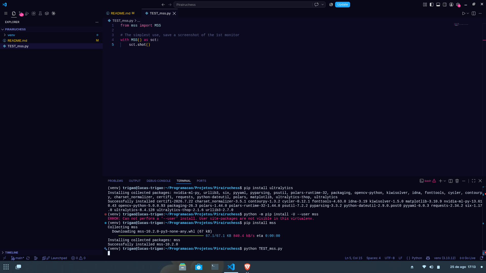

# MSS

This library is responsable for recording the user's screen. It does by screenshoting frame by frame.

A simplles example of how to screenshot your first monitor at [TEST_mss.py](/Tutorials/TEST_mss.py)

```python
from mss import MSS

with MSS() as sct:
    sct.shot()
```

**Output:**


## Monitors

With the mss library we can access it's attributs, like 'monitors':
```python
import time
import cv2
import numpy as np
import mss

with mss.MSS() as sct:
    monitor = {"top": 60, "left": 600, "width": 500, "height": 400}
    while "Screen capturing":
        last_time = time.time()
        img = np.array(sct.grab(monitor))
        cv2.imshow("Pirairuchess", img)
        if cv2.waitKey(25) & 0xFF == ord("q"):
            print(sct.monitors)
            cv2.destroyAllWindows()
            break

# And the output will be something like this:
[{'left': 0, 'top': 0, 'width': 3840, 'height': 1080}, {'left': 0, 'top': 0, 'width': 1920, 'height': 1080, 'is_primary': True, 'output': 'HDMI-2', 'name': '24B1W', 'unique_id': 'model=AOC2401&serial=1G9Q3HA000728&mfr_date=2024W12'}, {'left': 1920, 'top': 0, 'width': 1920, 'height': 1080, 'is_primary': False, 'output': 'eDP-1', 'unique_id': 'model=BOE0812&mfr_date=2018W31'}]
```
So the 0 index is "all monitors", side by side and the subsequents dictionaries are the actual monitors, with `left` and `top` as it's origin point, `width` and `height` as it's size, `is_primary` for "primaryness" and the other properties are for the monitor description.